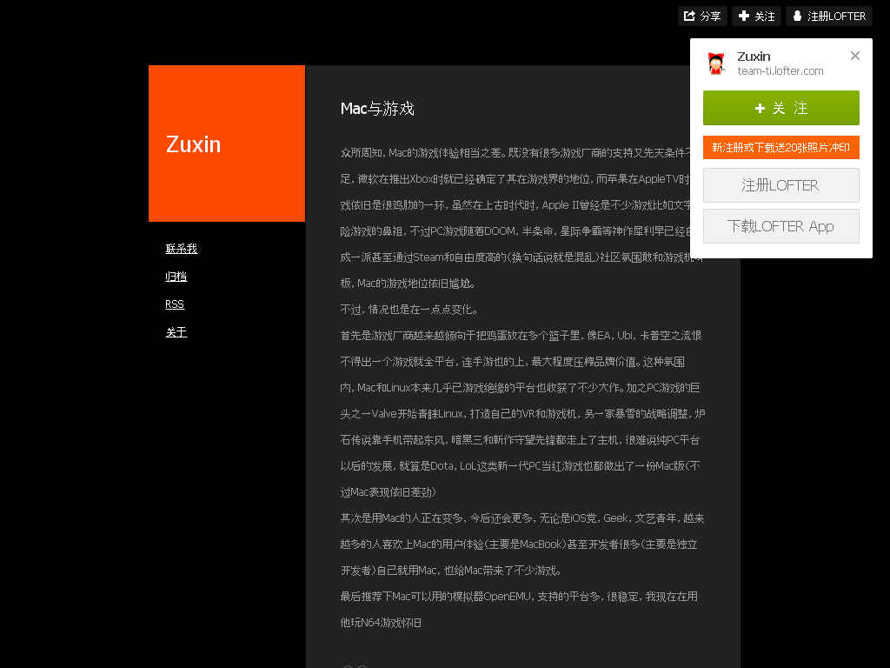

Mac与游戏
=========

2016-06-04

  众所周知，Mac的游戏体验相当之差。既没有很多游戏厂商的支持又先天条件不足，微软在推出Xbox时就已经确定了其在游戏界的地位，而苹果在AppleTV时游戏依旧是很鸡肋的一环，虽然在上古时代时，Apple II曾经是不少游戏比如文字冒险游戏的鼻祖，不过PC游戏随着DOOM，半条命，星际争霸等神作犀利早已经自成一派甚至通过Steam和自由度高的（换句话说就是混乱）社区氛围敢和游戏机叫板，Mac的游戏地位依旧尴尬。

  不过，情况也是在一点点变化。

  首先是游戏厂商越来越倾向于把鸡蛋放在多个篮子里，像EA，Ubi，卡普空之流恨不得出一个游戏就全平台，连手游也的上，最大程度压榨品牌价值。这种氛围内，Mac和Linux本来几乎已游戏绝缘的平台也收获了不少大作。加之PC游戏的巨头之一Valve开始青睐Linux，打造自己的VR和游戏机，另一家暴雪的战略调整，炉石传说靠手机带起东风，暗黑三和新作守望先锋都走上了主机，很难说纯PC平台以后的发展，就算是Dota，LoL这类新一代PC当红游戏也都做出了一份Mac版（不过Mac表现依旧差劲）

  其次是用Mac的人正在变多，今后还会更多，无论是iOS党，Geek，文艺青年，越来越多的人喜欢上Mac的用户体验（主要是MacBook）甚至开发者很多（主要是独立开发者）自己就用Mac，也给Mac带来了不少游戏。

  最后推荐下Mac可以用的模拟器OpenEMU，支持的平台多，很稳定，我现在在用他玩N64游戏怀旧

出典
----

http://team-ti.lofter.com/post/33ef66_b36724a

存档：https://archive.is/t5EN3

