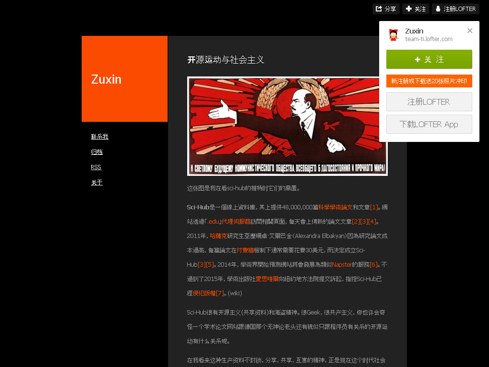

开源运动与社会主义
==================

2016-06-12

  .. image:: images/开源运动与社会主义-01.jpg

  这张图是我在看sci-hub的推特时它们的鼎置。

  Sci-Hub是一個線上資料庫，其上提供48,000,000篇科學學術論文和文章[1]。網站透過「.edu」代理伺服器訪問相關頁面，每天會上傳新的論文文章[2][3][4]。2011年，哈薩克研究生亞歷珊卓·艾爾巴金（Alexandra Elbakyan）因為研究論文成本過高，每篇論文在付費牆機制下通常需要花費30美元，而決定成立Sci-Hub[3][5]。2014年，學術界開始預測網站將會發展為類似Napster的服務[6]。不過到了2015年，學術出版社愛思唯爾向紐約地方法院提交訴訟，指控Sci-Hub已經侵犯版權[7]。(wiki)

  Sci-Hub很有开源主义(共享资料)和海盗精神。很Geek，很共产主义，你也许会奇怪一个学术论文网站跟德国那个无神论老头还有貌似只跟程序员有关系的开源运动有什么关系呢。

  在我看来这种生产资料不封锁，分享，共享，互惠的精神，正是现在这个时代社会主义的精神继承者，在生产资料不封锁的情况下，才可能会打破垄断，而且这种开源趋势越来越明显。

  比爾 ·蓋茨把支持開源運動的人稱為當代共產主義者，而SAP管理團隊的Shai Agassi把開源和社會主義進行比較。(開源：資本主義者和共產主義者怎樣把它弄錯了)

  从GNU/Linux,到Python,MySQL,到各种Open开头的库层出不穷，在软件界之外，其他的开源也层出不穷，开源硬件Arduino，Raspberry Pi。在学术界也开始有此风气，甚至我见过共享菜谱的网站，似乎看起来一切都那么美好。

  然后你要知道开源的本质不是免费，而是一种共享，共改，反垄的精神内涵。这也是为什么有些开源软件仍旧收费，有些开源只是部分开源(比如开放改编权)。

  But, as you soon know, your freedom has a price.(Starcraft2)

  所以这种精神发展到头是什么，是。。进化论，是自然选择。

  没有了权威的舒服，只有最强的人才会活下来，举个例子？Linux发行版有多少，光我们看的见的就有Ubuntu,Debian,红帽等等，可事实上Linux发行版海了去了，只有最强的最有用的大家才能记住，才有研究的价值。所以，如果说这种共产主义是共产的话，最后生产资料平等依旧会优胜劣汰，抱歉这就是自然法则，人人平等是不可能的，在都被剥削或者垄断的情况下，大部分人才会“平等”。

  授人以鱼不如授人以渔(《史记》)

  但是，这种精神目前以及一段时间的未来对普通大众依旧是有利的，在未来高度自动化的时代，也许体力劳动将不复存在，我们将有权利获得我们想要的知识。

出典
----

http://team-ti.lofter.com/post/33ef66_b4cae6d

存档：https://archive.is/Bu0dr

