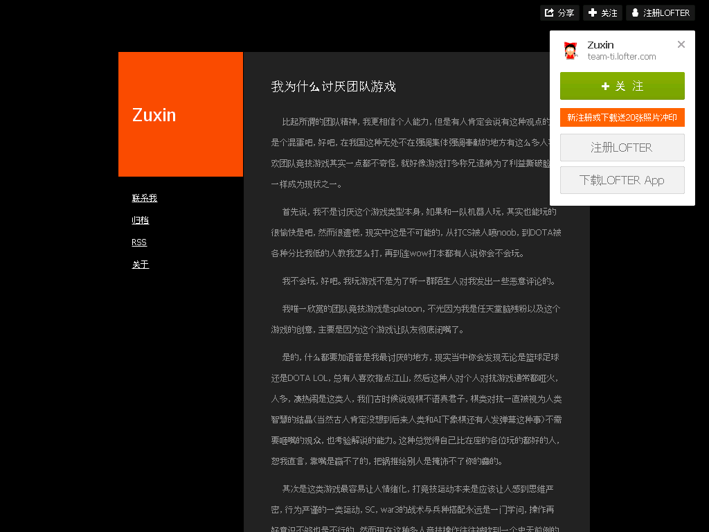

我为什么讨厌团队游戏
====================

2016-07-23

  比起所谓的团队精神，我更相信个人能力，但是有人肯定会说有这种观点的人是个混蛋吧，好吧，在我国这种无处不在强调集体强调奉献的地方有这么多人喜欢团队竞技游戏其实一点都不奇怪，就好像游戏打多称兄道弟为了利益撕破脸皮一样成为现状之一。

  首先说，我不是讨厌这个游戏类型本身，如果和一队机器人玩，其实也能玩的很愉快是吧，然而很遗憾，现实中这是不可能的，从打CS被人喷noob，到DOTA被各种分比我低的人教我怎么打，再到连wow打本都有人说你会不会玩。

  我不会玩，好吧。我玩游戏不是为了听一群陌生人对我发出一些恶意评论的。

  我唯一欣赏的团队竞技游戏是splatoon，不光因为我是任天堂脑残粉以及这个游戏的创意，主要是因为这个游戏让队友彻底闭嘴了。

  是的，什么都要加语音是我最讨厌的地方，现实当中你会发现无论是篮球足球还是DOTA LOL，总有人喜欢指点江山，然后这种人对个人对抗游戏通常都哑火，人多，凑热闹是这类人，我们古时候说观棋不语真君子，棋类对抗一直被视为人类智慧的结晶（当然古人肯定没想到后来人类和AI下象棋还有人发弹幕这种事）不需要咂嘴的观众，也考验解说的能力。这种总觉得自己比在座的各位玩的都好的人，恕我直言，靠嘴是赢不了的，把锅推给别人是掩饰不了你的蠢的。

  其次是这类游戏最容易让人情绪化，打竞技运动本来是应该让人感到思维严密，行为严谨的一类运动，SC，war3的战术与兵种搭配永远是一门学问，操作再好意识不够也是不行的，然而现在这种多人竞技操作往往被吹到一个史无前例的高度，仿佛技术高就可以力挽狂澜，一人做英雄，在这种胜利了多巴胺分泌量极大（因为秀技术杀人确实有很大快感）失败了可以归结于队友傻逼的游戏，人心态难免会崩，就算是专业战队也避免不了战术意见不合的冲突，所以往往在团队游戏，有教练一职来负责担当下棋者的身份排兵布阵，外加实行最高解释权，解决争端。然而路人局，谁都不认为自己玩的差，加上很大一部分人相当不会说（人）话，情绪化在所难免。

  如果一个游戏没给你带来快乐到给你带来了痛苦你还玩个什么，图什么呢是不是。

  固然，DOTA，LOL，CS等等都是伟大的游戏，但是不好意思，在这个大环境下，我实在是喜欢不起来，现在守望先锋这么火，老实说我可能会去玩但是不是太感冒，因为我打心底里讨厌团队游戏。

  P.S:本文不针对任何游戏，纯属个人主观色彩不带任何客观因素。

出典
----

http://team-ti.lofter.com/post/33ef66_bc7db76

归档：https://archive.is/1f7kI

