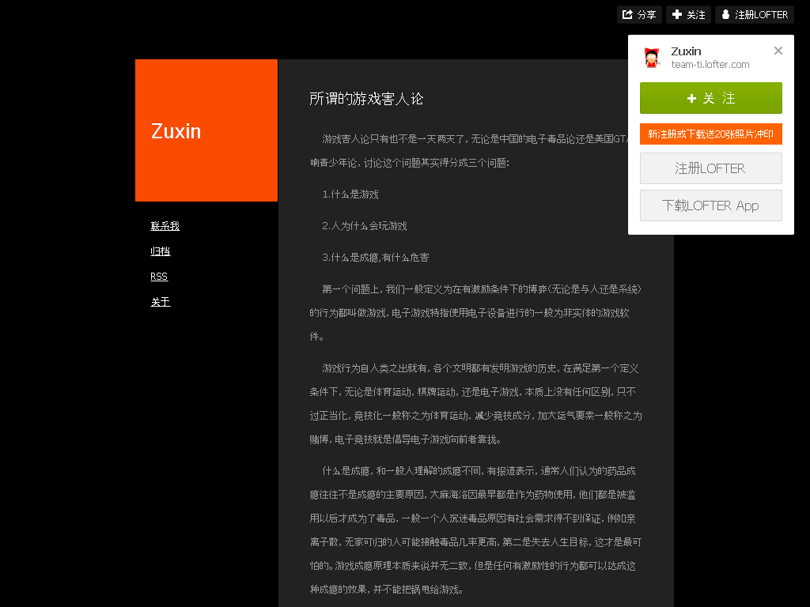

所谓的游戏害人论
================

2016-07-25

  游戏害人论只有也不是一天两天了，无论是中国的电子毒品论还是美国GTA影响青少年论，讨论这个问题其实得分成三个问题：

  1.什么是游戏

  2.人为什么会玩游戏

  3.什么是成瘾,有什么危害

  第一个问题上，我们一般定义为在有激励条件下的博弈（无论是与人还是系统）的行为都叫做游戏，电子游戏特指使用电子设备进行的一般为非实体的游戏软件。

  游戏行为自人类之出就有，各个文明都有发明游戏的历史，在满足第一个定义条件下，无论是体育运动，棋牌运动，还是电子游戏，本质上没有任何区别，只不过正当化，竞技化一般称之为体育运动，减少竞技成分，加大运气要素一般称之为赌博，电子竞技就是倡导电子游戏向前者靠拢。

  什么是成瘾，和一般人理解的成瘾不同，有报道表示，通常人们认为的药品成瘾往往不是成瘾的主要原因，大麻海洛因最早都是作为药物使用，他们都是被滥用以后才成为了毒品，一般一个人沉迷毒品原因有社会需求得不到保证，例如亲离子散，无家可归的人可能接触毒品几率更高，第二是失去人生目标，这才是最可怕的。游戏成瘾原理本质来说并无二致，但是任何有激励性的行为都可以达成这种成瘾的效果，并不能把锅甩给游戏。

  单纯的把锅丢给带给我们美好娱乐甚至科学意义的游戏是不对的，与其指责什么游戏危害孩子倒不如看看孩子到底的没得到关心，他的需要有没有得到诉说，而不是残忍的送孩子去电疗，更不是指责制造游戏的厂商，这不过是一种自认为道德高尚的无知罢了。

出典
----

http://team-ti.lofter.com/post/33ef66_bc9fd2f

归档：https://archive.is/t9UzM

