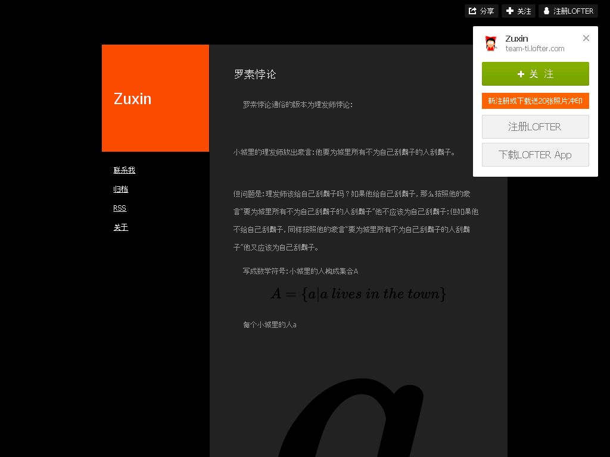

罗素悖论
========

2016-07-07

  罗素悖论通俗的版本为理发师悖论：

  小城里的理发师放出豪言：他要为城里所有不为自己刮鬍子的人刮鬍子。

  但问题是：理发师该给自己刮鬍子吗？如果他给自己刮鬍子，那么按照他的豪言“要为城里所有不为自己刮鬍子的人刮鬍子”他不应该为自己刮鬍子；但如果他不给自己刮鬍子，同样按照他的豪言“要为城里所有不为自己刮鬍子的人刮鬍子”他又应该为自己刮鬍子。

  写成数学符号：小城里的人构成集合A

  ``A = {a|a lives in the town}``

  每个小城里的人``a``可以构造一个``A``的子集S

  ``Sa = {x|a shaves x}``

  如果城里人``a``给自己刮鬍子，则``a E Sa``，如果``a``不给自己刮鬍子，则``a E/ Sa``，如果``a``不给任何人刮鬍子，则``Sa`` 为空，即``Sa = {}``。

  理发师的豪言就是：``Ss = {a|a E/ Sa}``

  如果``s E Ss``，这将与``Ss``的定义矛盾，但如果``s E/ Ss``，根据``Ss``的定义，又应该有``s E Ss``。

  解决方法：朴素集合论(Naive Set theory)中提到了通过定义严格避免悖论，nothing contains everything(没有集合能包含世间万物)也就是说there's no universe.

  一个集合不能属于它自身。

注：因原文图片过大影响阅读，部分已替换为文字表示。

出典
----

http://team-ti.lofter.com/post/33ef66_b9a04a7

归档：https://archive.is/SAGfz

