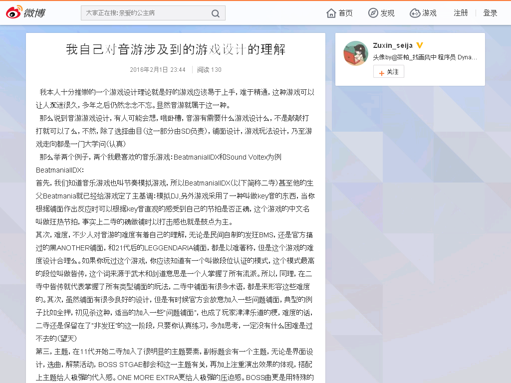

我自己对音游涉及到的游戏设计的理解
==================================

2016年2月1日 23:44

  我本人十分推崇的一个游戏设计理论就是好的游戏应该易于上手，难于精通，这种游戏可以让人沉迷很久，多年之后仍然念念不忘。显然音游就属于这一种。

  那么说到音游游戏设计，有人可能会想，哦卧槽，音游有需要什么游戏设计么，不是敲敲打打就可以了么，不然，除了选择曲目（这一部分由SD负责），铺面设计，游戏玩法设计，乃至游戏走向都是一门大学问（认真）

  那么举两个例子，两个我最喜欢的音乐游戏：BeatmaniaIIDX和Sound Voltex为例

  BeatmaniaIIDX：

  首先，我们知道音乐游戏也叫节奏模拟游戏，所以BeatmaniaIIDX（以下简称二寺）甚至他的生父Beatmania就已经给游戏定了主基调：模拟DJ,另外游戏采用了一种叫做key音的东西，当你根据铺面作出反应时可以根据key音直观的感受到自己的节拍是否正确，这个游戏的中文名叫做狂热节拍，事实上二寺的确做铺时以打击感也就是鼓点为主。

  其次，难度，不少人对音游的难度有着自己的理解，无论是民间自制的发狂BMS，还是官方搞过的黑ANOTHER铺面，和21代后的LEGGENDARIA铺面，都是以难著称，但是这个游戏的难度设计合理么。如果你玩过这个游戏，你应该知道有一个叫做段位认证的模式，这个模式最高的段位叫做皆传，这个词来源于武术和剑道意思是一个人掌握了所有流派。所以，同理，在二寺中皆传就代表掌握了所有类型铺面的玩法，二寺中铺面有很多术语，都是来形容这些难度的。其次，虽然铺面有很多良好的设计，但是有时候官方会故意加入一些问题铺面，典型的例子比如全押，初见杀这种，适当的加入一些“问题铺面”，也成了玩家津津乐道的梗，难度的话，二寺还是保留在了“非发狂”的这一阶段，只要你认真练习，多加思考，一定没有什么困难是过不去的（望天）

  第三，主题，在11代开始二寺加入了很明显的主题要素，副标题会有一个主题，无论是界面设计，选曲，解禁活动，BOSS STGAE都会和这一主题有关，再加上注重演出效果的体现，搭配上主题给人极强的代入感。ONE MORE EXTRA更给人极强的压迫感。BOSS曲更是用特殊的BGA达到演出效果，感染力极强。

  当然IIDX不是没有自己的问题，上手需要一定量的练习一直是IIDX的一个问题，因为要适应7K＋1皿的轨道的键位和读谱都是慢慢来的，调整速度也是新人一大头疼的问题，不过官方也通过SET UP，EASY模式，简化判定，手动延迟来修复一些这种问题，正是有了这些迷人的要素，二寺成为了一个超长寿的音乐游戏，23代的代数放在音游之外都是十分罕见的吧。

  Sound Voltex：

  在早先模拟类音乐游戏的浪潮过后，新生的音乐游戏一般都不注重模拟真实乐器了，采取了巧妙的方法，而Sound Voltex（以下简称SDVX）主打的就是疾走感。

  如何保持疾走感呢，首先通过曲目限制，大部分SDVX的曲目除去东方project和EXIT TUNES的搬去曲，其他的大部分曲目通过公募得来，吸引了很多BMS作者，和爱好音游的同音作家，曲目要求一大限制就是必须保持在2分钟之内，让一些本来没打算做快的音乐加快了脚步（比如玄武remix）

  其次是玩法，虽然也有模拟DJ的要素，但是配合极强的画面特效给人一种强烈的画面感，音乐的FX特效搭配上画面晃来晃去仿佛如过山车一样，而且二代增加了新种类的note和段位之后，三代又深化了旋钮（我猜迟迟没出4的原因也是暂时没什么好加的玩法）

  其次是吸收了课金手游抽卡的玩法，变成了音游结束后抽卡，甚至搭配了实体抽卡机，一切都是最早想法的深化，让游戏越来越有趣，在游戏的官方比赛KAC上，SDVX制作组也是“最会玩”的，感兴趣的请自己看看视频。

  对我来说，这些游戏依旧有着很多可能性，这也是他们迷人的地方，不管如何，希望他们能够越来越好，继续推陈出新。

出典
----

http://weibo.com/p/1001603937855780030469

存档：https://archive.is/2JgnR

