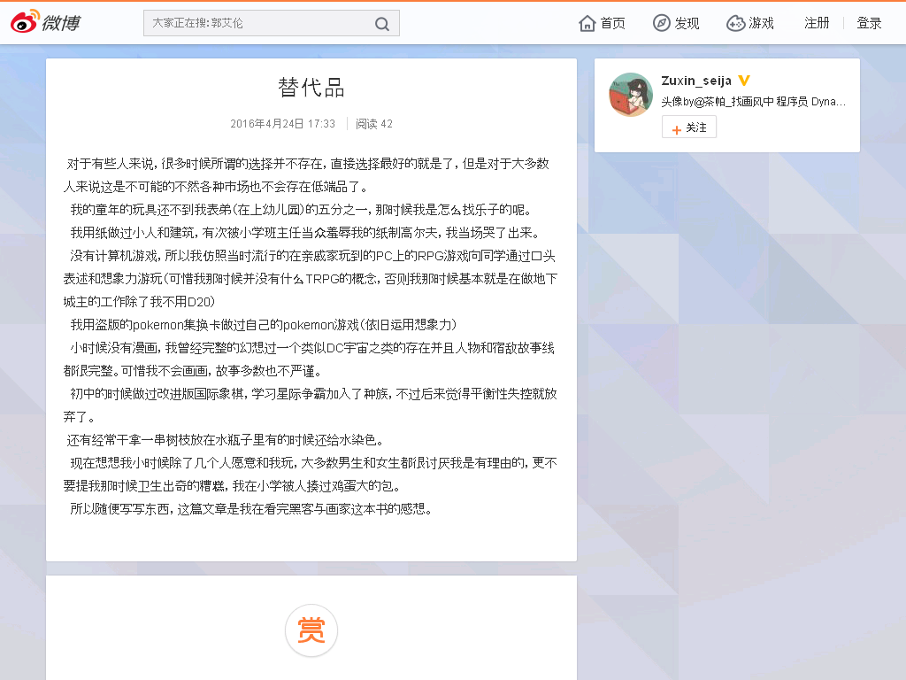

替代品
======

2016年4月24日 17:33

  对于有些人来说，很多时候所谓的选择并不存在，直接选择最好的就是了，但是对于大多数人来说这是不可能的不然各种市场也不会存在低端品了。

  我的童年的玩具还不到我表弟（在上幼儿园）的五分之一，那时候我是怎么找乐子的呢。

  我用纸做过小人和建筑，有次被小学班主任当众羞辱我的纸制高尔夫，我当场哭了出来。

  没有计算机游戏，所以我仿照当时流行的在亲戚家玩到的PC上的RPG游戏向同学通过口头表述和想象力游玩（可惜我那时候并没有什么TRPG的概念，否则我那时候基本就是在做地下城主的工作除了我不用D20）

  我用盗版的pokemon集换卡做过自己的pokemon游戏（依旧运用想象力）

  小时候没有漫画，我曾经完整的幻想过一个类似DC宇宙之类的存在并且人物和宿敌故事线都很完整。可惜我不会画画，故事多数也不严谨。

  初中的时候做过改进版国际象棋，学习星际争霸加入了种族，不过后来觉得平衡性失控就放弃了。

  还有经常干拿一串树枝放在水瓶子里有的时候还给水染色。

  现在想想我小时候除了几个人愿意和我玩，大多数男生和女生都很讨厌我是有理由的，更不要提我那时候卫生出奇的糟糕，我在小学被人揍过鸡蛋大的包。

  所以随便写写东西，这篇文章是我在看完黑客与画家这本书的感想。 

出典
----

http://weibo.com/p/1001603967840699942338

存档：https://archive.is/yMN76

